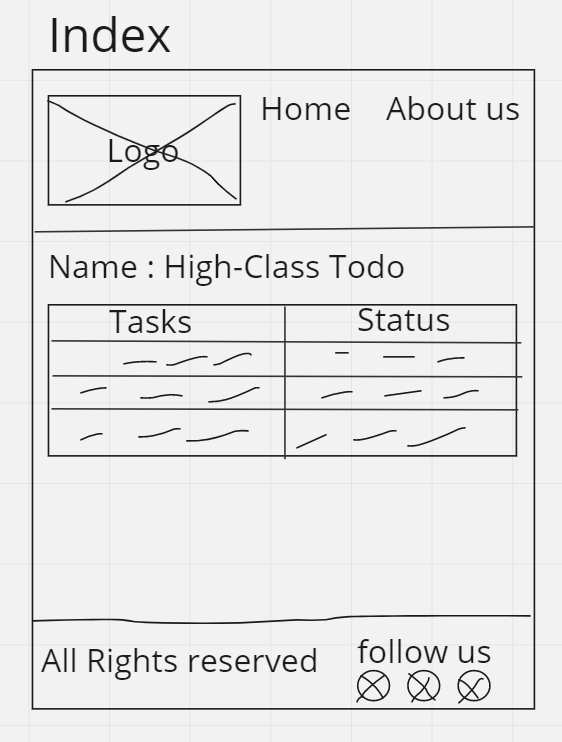
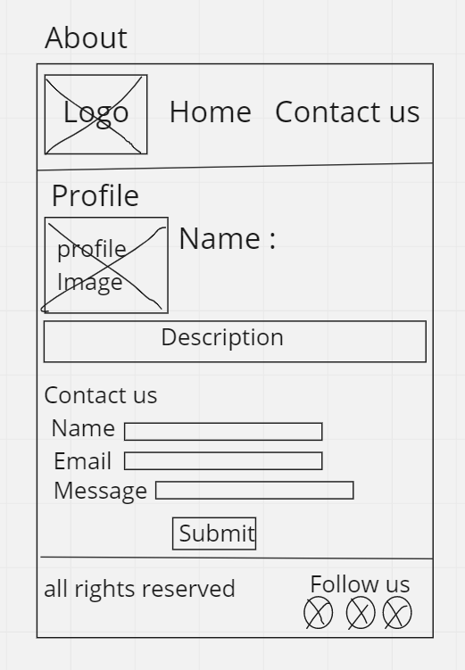

# todo-project lab

***so far i dont really have any questions considering my level in programming,but overall its fun to take part in old knowledge***

**it took near 15 minutes for me to finish everything , most time went on drawing the wireframe considering im bad at drawing but i got it managed this time with a decent wireframe this time,i expected to finish around the same time i have taken**

